# SoFi Pockets — UI mockups

Spendable sub-accounts ("pockets") inside SoFi Checking. Each pocket gets its own
virtual debit card in Apple Wallet that can only spend from that pocket. Pockets can
be shared with roommates for rent, groceries, or a group trip. Aimed at college
students. Paying from a pocket earns partner perks.

**Concept case study. Not a shipping product, not a commitment to build anything.**

🔗 **[Browse the screens →](https://jchiu-sofi.github.io/pockets/)**

The linked gallery is live and interactive: each frame is the real HTML, so you can
scroll inside it. The images below are static captures for quick scanning.

## Screens

| | | |
|:--:|:--:|:--:|
| 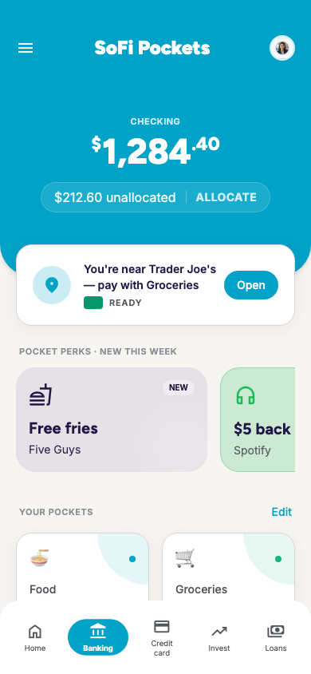<br>**01** Pockets home | 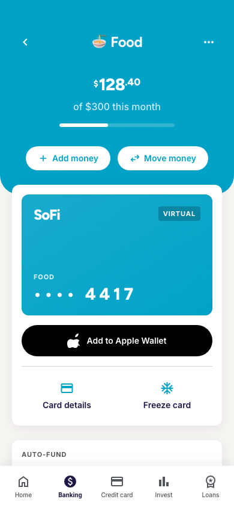<br>**02** Food pocket detail | 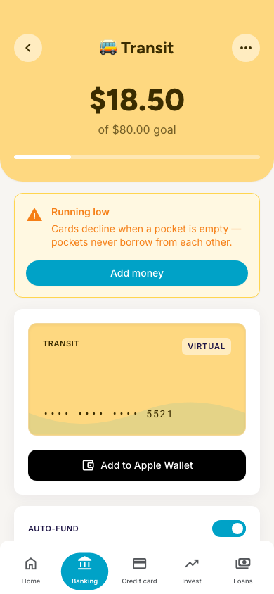<br>**03** Transit low balance |
| 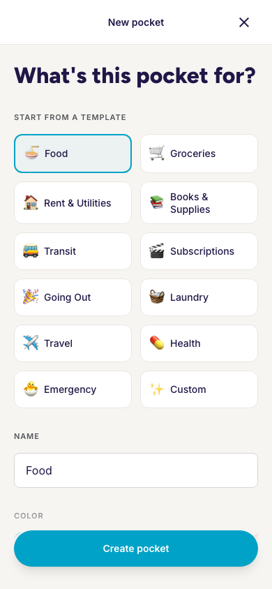<br>**04** Create a pocket | 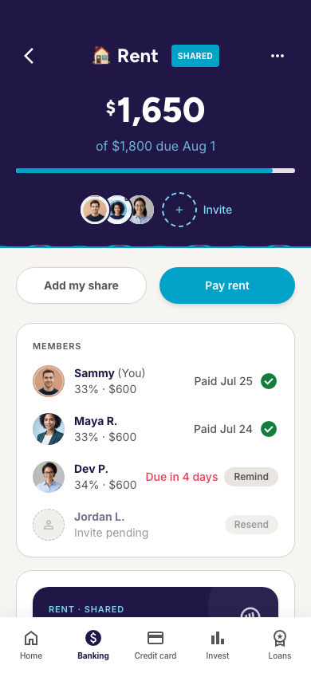<br>**05** Rent, shared | 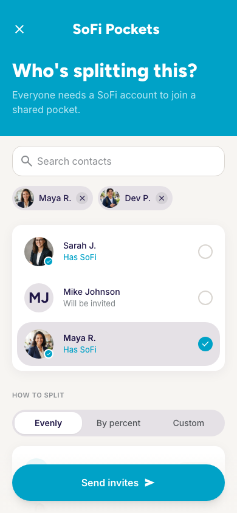<br>**06** Invite friends |
| 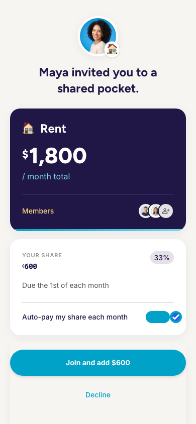<br>**07** Invite received | 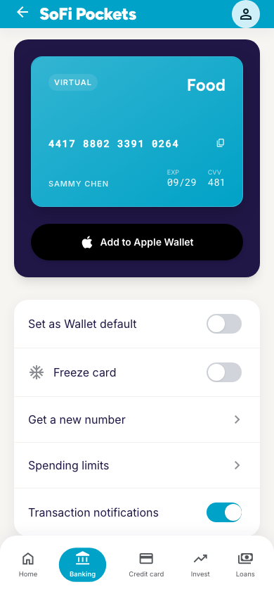<br>**08** Card details + Wallet | 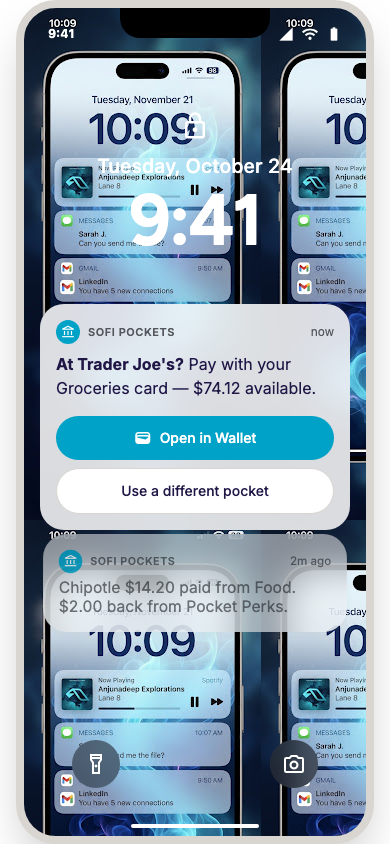<br>**09** Lock screen notification |
| 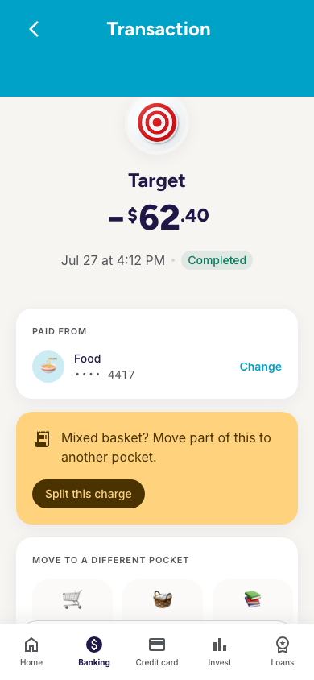<br>**10** Transaction + rerouting | 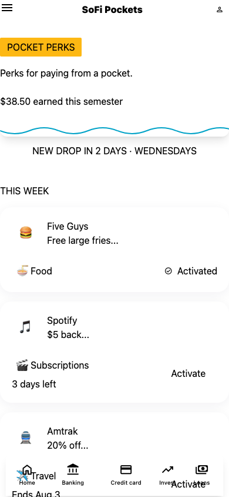<br>**11** Pocket Perks | 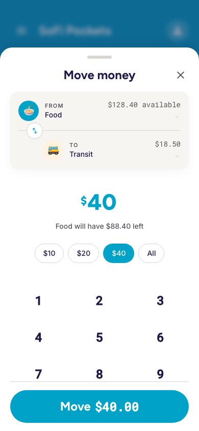<br>**12** Move money |
| 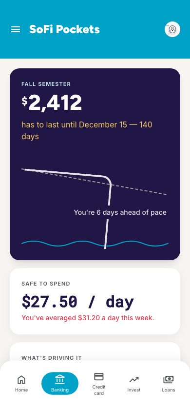<br>**13** Semester runway | 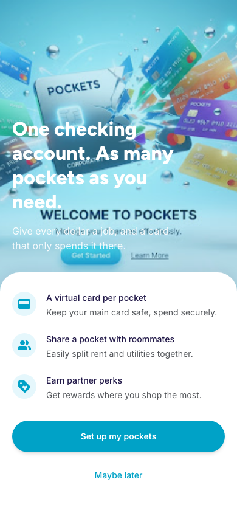<br>**14** Onboarding | 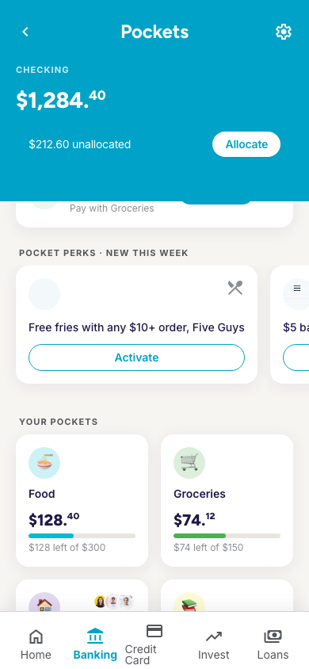<br>**15** Home (alt) |
| 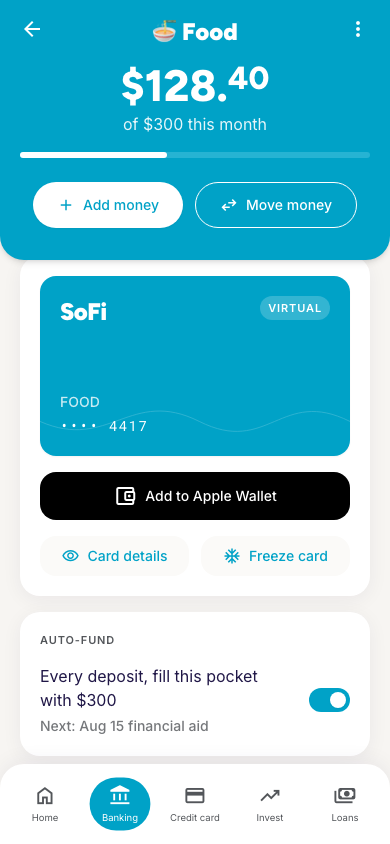<br>**16** Food detail (alt) | | |

**Start with 03, 09, and 10.** They answer the three questions every reviewer asks:
what happens when a pocket is empty, how the right card gets surfaced when Apple
Wallet can't be steered programmatically, and what happens at Target when one basket
spans two pockets.

## Look at them locally

```bash
open docs/index.html                        # all 16, live and scrollable
open docs/screens/01-pockets-home.html      # one screen, full size
```

No build step and nothing to install — Tailwind and the fonts come from CDNs.

## Edit them

Open this folder in Claude Code and describe the change. Every screen is a standalone
HTML file with an inline Tailwind config, so edits are direct and reviewable as a
diff.

```bash
./render.sh              # all screens → renders/*.png, rebuilds the gallery
./render.sh 05-rent      # just one
SCALE=2 ./render.sh      # retina captures for a deck
./render.sh --gallery-only
```

Two things worth knowing before you touch the tooling:

- **Colors live in each file's inline `tailwind.config`, not in the class names.**
  `tools/apply-brand.py` rewrites them by token name, so a palette change is one edit
  that propagates to every `bg-primary` in the markup. Run it after regenerating
  anything in Stitch; it's idempotent.
- **`render.sh` captures through an iframe on purpose.** Headless Chrome clamps
  `--window-size` to a ~500px minimum layout viewport and then crops the screenshot
  to the size you asked for, so a naive `--window-size=390,844` photographs a 500px
  layout through a 390px window and silently shears off the right edge. Screens are
  loaded in an exact-width iframe and the surrounding window is cropped away.

## What's here

| Path | What it is |
|---|---|
| `docs/screens/*.html` | The 16 screens. Source of truth. |
| `docs/index.html` | Gallery. What Pages serves. Rebuilt by `render.sh`. |
| `renders/*.png` | Static captures, committed so they render in this README. |
| `decisions.md` | Locked decisions, deferred issues, legal edge cases. **Read before changing a joint-pocket screen.** |
| `stitch-prompt.md` | The Stitch prompts these came from, plus the extracted brand spec. |
| `tools/apply-brand.py` | Rewrites the palette to brand hexes. |
| `tools/trim-png.py` | PNG crop/trim helper used by `render.sh`. |
| `tools/stitch-mcp-proxy.mjs` | Lets Claude Code drive Google Stitch. |

## Publishing

Pages serves the live gallery from `main` → `/docs`, so a push updates the site:

```bash
./render.sh            # rebuild docs/index.html and the captures
git add -A && git commit -m "Update screens" && git push
```

If Pages ever needs re-enabling: **Settings → Pages → Deploy from a branch → main,
`/docs`**, or

```bash
gh api -X POST repos/jchiu-sofi/pockets/pages \
  -f 'source[branch]=main' -f 'source[path]=/docs'
```

## Regenerating in Stitch

These came out of a Stitch project through its MCP server. Google's endpoint ships a
malformed tool schema (`upload_design_md.outputSchema` references
`#/$defs/ScreenInstance` with an empty `$defs`), and Claude Code validates every
schema at load, so one dangling ref drops all 15 tools. The local shim repairs it:

```bash
printf '%s' 'YOUR_KEY' > ~/.config/stitch/api-key && chmod 600 ~/.config/stitch/api-key
claude mcp add stitch -- node "$PWD/tools/stitch-mcp-proxy.mjs"
```

Note the argument order — `--header` is variadic, so a URL placed after it gets eaten
as another header value. Delete the shim once Google fixes the schema.

## Brand assets

The SoFi brand guidelines PDF and DAM preview are **not committed** — they're internal
source material and this repo is public. The palette, type stack, and graphic element
rules extracted from them are written up in `stitch-prompt.md`.
